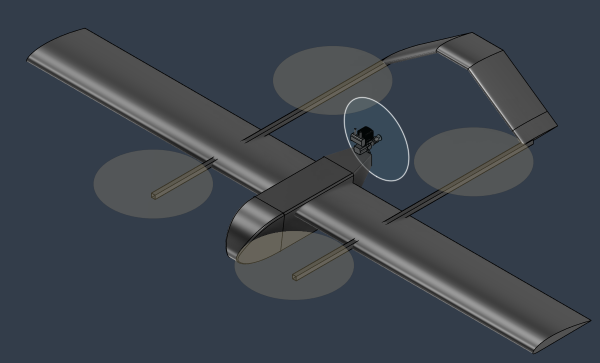
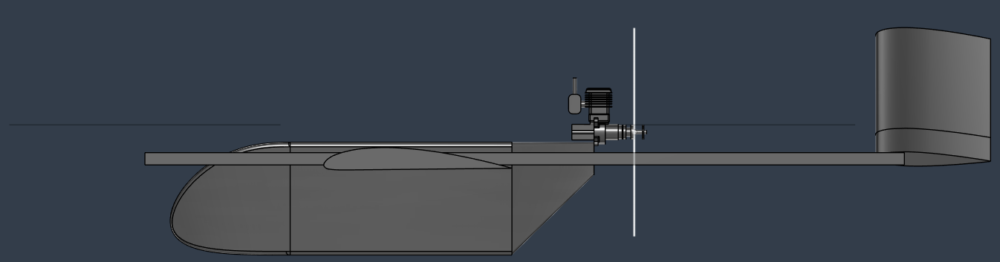
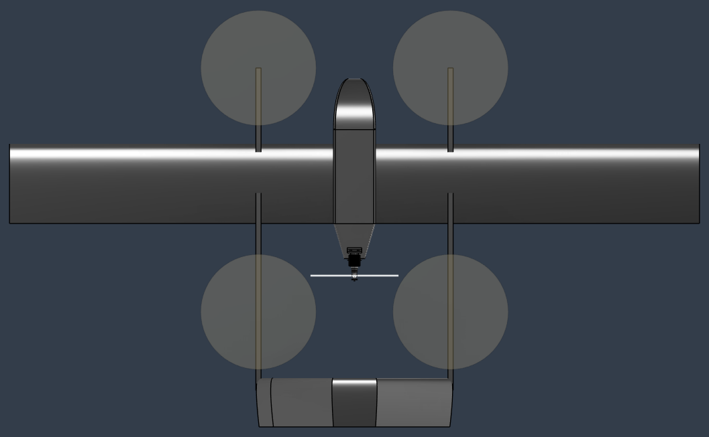

# Status

`Valid`

`Revision History: None`

`Replacement Log: None`

`Reference: None`

# Project Description

This information note documents the preliminary exterior design of Project Spearhead. The scope is the outer geometry: fuselage body, main wing, inverse V-tail, and the two longitudinal booms that carry the VTOL lift stations and support the aft tail geometry.

The design is a high-wing quadplane pusher layout. The central fuselage provides the main payload and systems volume. Two longitudinal side booms run parallel to the fuselage centerline and place the four VTOL lift disks around the wing and fuselage. The aft end of the boom system supports the inverse V-tail.

The resulting geometry will be used as a reference for structural design and aerodynamic database generation.

| Isometric view |
|----------------|
|  |

# Methodology

## 1. Fuselage Sizing Method

The fuselage exterior was sized from IC engine placement first. The cylinder was intentionally left outside the fuselage to improve cooling. The engine and exposed cylinder were placed above the aft fuselage and aligned with the upper exterior flow path for cleaner airflow around the cooling region. The IC engine and the related systems are covered by Aft Fuselage fairing.

The aft taper is intentionally short and sharp. A longer or fuller aft body would block more of the rear pusher propeller inflow, so the body is cut back quickly behind the main volume. Curvature was not added to the aft transition for the prototype because it would make Oratex covering more difficult. This is an accepted prototype compromise and can be smoothed later if needed.

After the IC engine placement, A 12S 16000 mah battery and a 6 L fuel tank were placed inside the fuselage. The fuel tank was placed centering the CG so that the CG will not shift with fuel burn during the flight. This section is covered by the Mid Fuselage fairing.

Then the nose is designed to minimize the drag while considering the weight. The nose houses the avionics if the CG area will have no room due to the structural elements.

## 2. Wing and Tail Sizing Method

The main wing and tail geometry were sized using the aerodynamic sizing tool. The tool was used for the main wing airfoil, tail airfoil, planform parameters, incidence values, and the longitudinal spacing between the main wing and tail.

The wing and tail spacing is defined using aerodynamic-center stations relative to the CG. The selected spacing is used with the chosen airfoils and planforms to satisfy cruise trim and tail volume requirements. The tail incidence is then solved by the sizing tool for zero-elevator cruise trim.

## 3. Longitudinal Boom Layout Method

The exterior design uses two straight longitudinal booms, one on each side of the fuselage. 

The lateral boom station was checked visually against the top and front views. The longitudinal positioning was done so that the VTOL motors center the CG. 

## 4. Tail Horizontal Wing Section

Due to the electrical elements and avionics in the tail region, the center of the tail wing is left horizontal. This section provides housing while making the access hatch easier to use.

# Results and Deliverables

## Fuselage Geometry

| Section | Length | Section size |
|---------|--------|--------------|
| Nose | About 355 mm | Expands to 240 mm by 275 mm |
| Mid body | About 540 mm | Constant 240 mm by 275 mm |
| Aft body | About 200 mm | Tapers to about 120 mm by 80 mm |
| Total | 1095 mm | 240 mm max width, 275 mm max height |

## Fuselage Sizing Inputs

| Package item | Sizing role |
|--------------|-------------|
| IC Engine | 35cc 2-Stroke IC Engine inside the fuselage |
| 12S 16000 mah battery | Primary power source inside fuselage |
| 6 L fuel tank | Cruise fuel source inside fuselage |

## Main Wing Geometry

| Parameter | Value |
|-----------|-------|
| Airfoil | Clark Z |
| Planform | Rectangular, unswept, untapered |
| Gross span | 3.95 m |
| Effective span | 3.65 m |
| Chord | 0.457 m |
| Gross area | 1.805 m2 |
| Effective area | 1.668 m2 |
| Effective aspect ratio | 8.0 |
| Incidence | 1.0 deg |
| Maximum thickness | 54 mm |

## Tail Geometry

| Parameter | Value |
|-----------|-------|
| Tail airfoil | NACA 0015 |
| Tail type | Inverse V-tail |
| Projected span | 1.100 m |
| Geometric span | 1.343 m |
| Chord | 0.28 m |
| Area | 0.376 m2 |
| Dihedral | 35 deg |
| Incidence | 2.0 deg |

## Main and Tail Wings Positioning

| Station | Value |
|---------|-------|
| Main wing AC relative to CG | 0.15 m forward |
| Tail AC relative to CG | 1.15 m aft |
| Main wing AC to tail AC distance | 1.30 m |

## Longitudinal Boom Layout

| Parameter | Value or description |
|-----------|----------------------|
| Boom count | 2 |
| Orientation | Longitudinal, parallel to fuselage centerline |
| Lateral station | About 550 mm from centerline |
| Length | 2 m |
| VTOL lift stations | Four total, two per boom, 700 mm longitudinal distance from CG |

| Side view |
|-----------|
|  |

| Front view |
|------------|
|  |

| Top view |
|----------|
|  |

## Source Files

| File | Use |
|------|-----|
| `fuselage.step` | Fuselage CAD model |
| `main_wing.step` | Main wing CAD model |
| `tail_wing.step` | Tail wing CAD model |
| `config.py` | Wing/tail station definitions |
| `sweep_results_re500000.txt` | Wing and tail sizing baseline |

# Remarks

- This note is intentionally limited to exterior geometry and the sizing drivers that define that geometry.
- The sharp aft transition and lack of curvature are known prototype compromises. They are accepted for now to protect rear pusher propeller inflow and simplify Oratex covering.