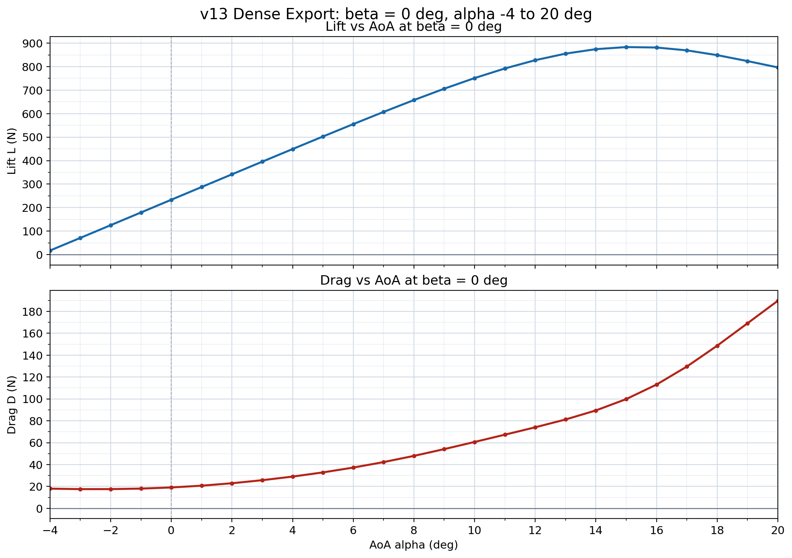

# Status

`Valid`

`Revision History: None`

`Replacement Log: None`

`Reference: None`

# Project Description

This information note documents the aerodynamic database generation work for Project Spearhead. The purpose of the database is to provide force and moment data over the aircraft angle-of-attack and sideslip envelope, so that the results can be used for flight dynamics modelling, control simulation, and later coefficient table generation.

The work was completed in four main steps. First, 80 comprehensive CFD analyses were solved with the actuator disk model. Then, 800 comprehensive CFD analyses were solved without the actuator disk model. After that, a surrogate surface was generated from the 800-case database. Finally, the 80-case actuator-disk database was used to apply a correction factor to the surrogate surface.

This note does not describe the internal operation of the database tool. It records how the tool was used in the aerodynamic database workflow and what was delivered.

The current deliverables are the corrected aerodynamic database surface and the SakeDB setup file prepared for this database stage. Control surface deflections and final coefficient conversion are separate work.

# Methodology

## 1. Actuator Disk Database

The first database was generated with the actuator disk model. This database includes 80 CFD analyses and is used to capture the aerodynamic effect of the pusher propeller model.

This database is not used as the full final surface by itself. It is used as the correction source for the larger no-actuator-disk surrogate surface.

## 2. No-Actuator-Disk Database

The second database was generated without the actuator disk model. This database includes 800 CFD analyses and covers the broader aircraft angle-of-attack and sideslip envelope.

The no-actuator-disk database is used as the main aerodynamic surface because it has much wider coverage and more sample points than the actuator disk database.

## 3. Surrogate Surface Generation

After the 800-case no-actuator-disk database was completed, a surrogate surface was generated from these results. This surface is used to create a dense aerodynamic table over the complete database range.

The database variables are alpha and beta. The exported outputs are dimensional body-axis force and moment components: `Fx`, `Fy`, `Fz`, `Mx`, `My`, and `Mz`.

## 4. Correction Factor Application

The actuator-disk database was then compared with the corresponding no-actuator-disk database values. From this comparison, a correction factor was applied to the surrogate surface.

This correction transfers the propeller model effect from the 80 actuator-disk analyses onto the larger 800-case surrogate surface. The corrected surface is treated as the completed aerodynamic database for this stage.

# Results and Deliverables

## Workflow Summary

| Step | Case count | Description |
|------|------------|-------------|
| Actuator disk CFD database | 80 | Database generated with the pusher actuator disk model |
| No-actuator-disk CFD database | 800 | Main aerodynamic database generated without the actuator disk model |
| Surrogate surface | 800-case source | Surface generated from the no-actuator-disk database |
| Correction factor application | 80-case source | Actuator-disk database used to correct the surrogate surface |

## Database Range and Outputs

| Parameter | Value |
|-----------|-------|
| Main database version | v13 |
| Main CFD case count | 800 |
| Actuator-disk correction database case count | 80 |
| Main database computed alpha range | -90 deg to 90 deg |
| Main database computed beta range | 0 deg to 90 deg |
| Exported symmetric beta range | -90 deg to 90 deg |
| Outputs | Fx, Fy, Fz, Mx, My, Mz |
| SakeDB file | `v13.sakedb` |

## Exported Tables

| Table | Rows | Description |
|-------|------|-------------|
| Actuator disk CFD sample table | 80 | Direct CFD samples with the actuator disk model |
| Actuator disk symmetric reference table | 148 | Actuator disk samples after beta symmetry |
| No-actuator-disk CFD sample table | 800 | Direct CFD samples without the actuator disk model |
| No-actuator-disk symmetric sample table | 1582 | No-actuator-disk samples after beta symmetry |
| Positive beta dense table | 16471 | 1 deg alpha by beta table for beta 0 deg to 90 deg |
| Full symmetric dense table | 32761 | 1 deg alpha by beta table for beta -90 deg to 90 deg |
| Corrected dense table | 32761 | Corrected surrogate surface after actuator-disk correction |

## Correction Summary

The corrected table was generated by comparing the actuator disk database against the no-actuator-disk surrogate surface at the available actuator disk support points. The resulting correction factor was then applied to the dense surrogate surface.

| Parameter | Value |
|-----------|-------|
| Correction source | 80-case actuator disk database |
| Surface being corrected | 800-case no-actuator-disk surrogate surface |
| Symmetric correction reference points | 148 |
| Corrected full dense rows | 32761 |
| Corrected positive beta rows | 16471 |
| Full dense rows with nonzero correction taper | 21029 |
| Positive beta rows with nonzero correction taper | 10587 |

## Correction Diagnostics

The table below shows the corrected table error when interpolated back at the actuator-disk support points. Values are in the output units of each force or moment component.

| Output | RMSE | Max abs error |
|--------|------|---------------|
| Fx | 0.161 | 1.090 |
| Fy | 0.085 | 0.334 |
| Fz | 0.475 | 2.377 |
| Mx | 0.159 | 0.819 |
| My | 0.302 | 1.900 |
| Mz | 0.067 | 0.455 |

## Beta 0 Lift and Drag Check

The beta 0 slice was extracted from the database and converted into lift and drag for a quick aerodynamic sanity check between alpha -4 deg and 20 deg.

| Beta 0 lift and drag extraction |
|---------------------------------|
|  |

## Source Files

| File |
|------|
| [SakeDB setup file](assets/v13.sakedb) |
| [Actuator disk CFD sample table](assets/actuator_disk_results.csv) |
| [Actuator disk symmetric reference table](assets/actuator_disk_results_symmetric.csv) |
| [No-actuator-disk CFD sample table](assets/results.csv) |
| [No-actuator-disk symmetric sample table](assets/results_symmetric.csv) |
| [Positive beta dense table](assets/dense_table_positive_beta.csv) |
| [Full symmetric dense table](assets/dense_table_symmetric.csv) |
| [Corrected dense table](assets/corrected_dense_table.csv) |
| [Corrected positive beta dense table](assets/corrected_dense_table_positive_beta.csv) |
| [Correction manifest](assets/correction_manifest.json) |
| [Beta 0 lift and drag extraction data](assets/beta0_lift_drag_vs_aoa_alpha_m4_20.csv) |

# Remarks

- This note records the database workflow and deliverables. It does not describe the internal operation of the database tool.
- The correction factor approach is accepted for the current aerodynamic database stage.
- Control surface deflections, coefficient conversion, and final flight dynamics table formatting are separate work.
- The corrected dense table should be treated as the current working table for this database stage.
