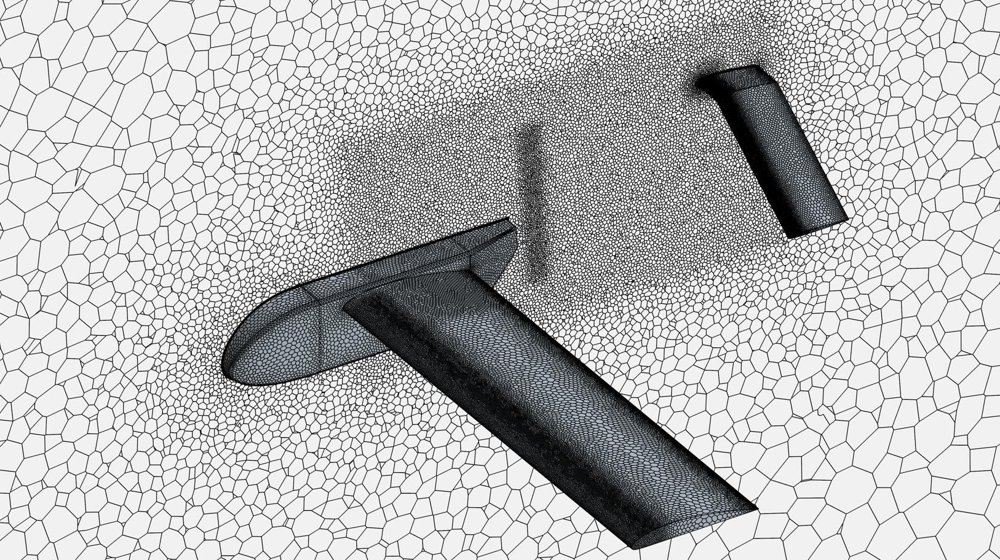
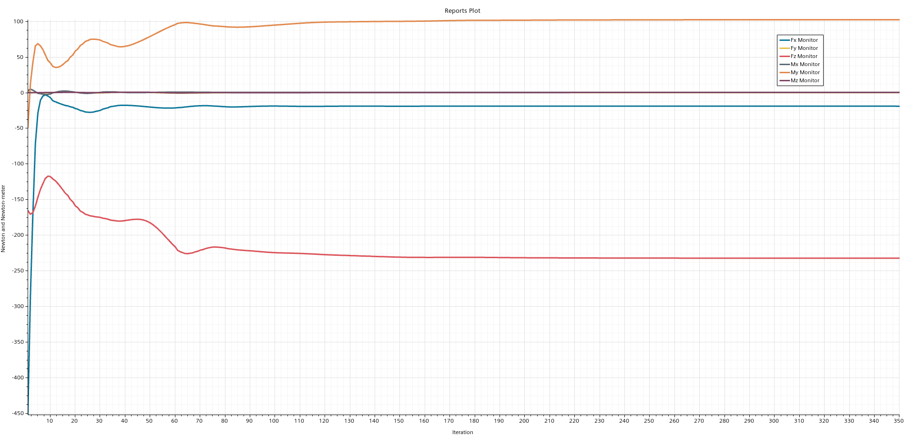
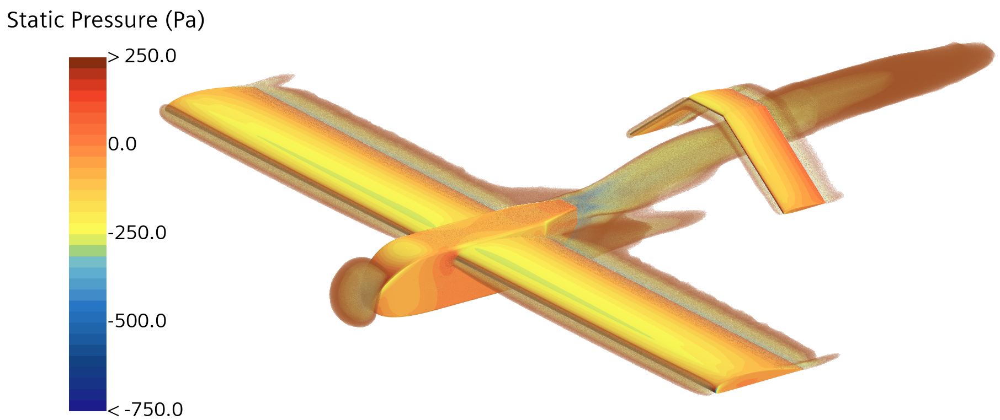
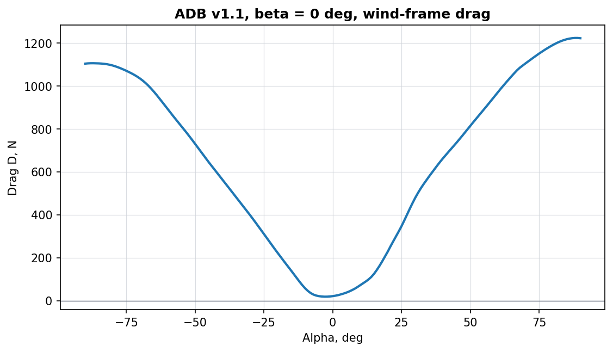
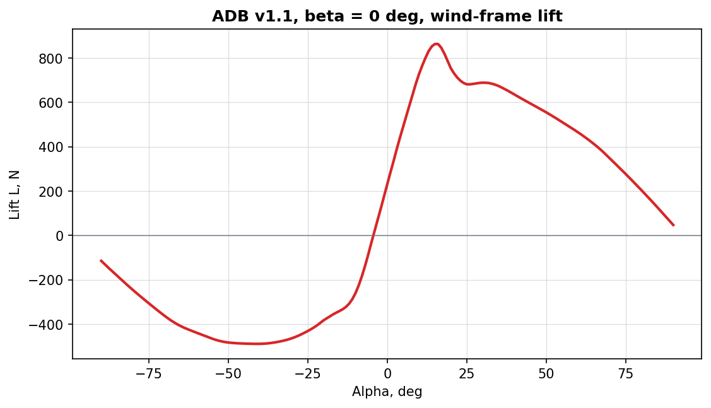
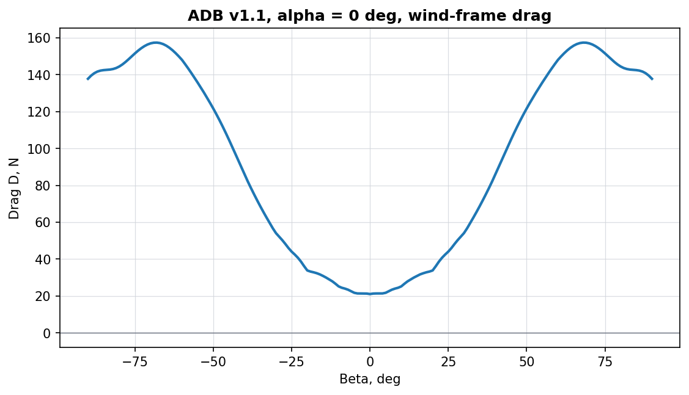
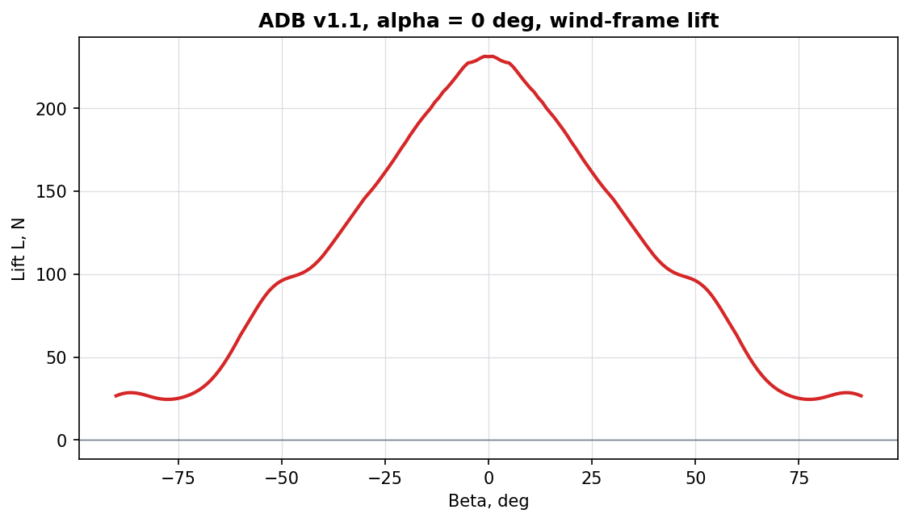

# Preliminary Design Aerodynamic Database

# Status

"Valid"

"Revision History: None"

"Replacement Log: None"

"Reference: None"

# Project Description

This information note documents the preliminary design aerodynamic database generation work for Project Spearhead. The purpose of the database is to provide force, moment, and coefficient data over the aircraft angle-of-attack and sideslip envelope, so that the results can be used for flight dynamics modelling, control simulation, and later flight-control table generation.

[SakeDB](/src/tools/SakeDB/README.md) was used to define and manage the CFD campaign. First, 80 CFD analyses were solved with the actuator disk model (ADM) simulating the pusher propeller. After that, 800 CFD analyses were solved without the actuator disk model. A surrogate surface was generated from the 800-case database, and the 80-case ADM database was used to apply a correction factor to the surrogate surface. Finally, the corrected dense output was processed with [Nondimit](/src/tools/Nondimit/README.md) for coefficient-table preparation, drag correction for omitted components, and sign-convention checks.

This note does not describe the internal operation of SakeDB or Nondimit. It records how the tools were used in the aerodynamic database workflow and what was delivered.

# Methodology

## 1. CFD Run Methodology

Each database point was solved as a steady incompressible CFD case. The analyses used a segregated flow solver with a K-Omega turbulence model. All Y+ wall treatment was used with five boundary-layer prism layers targeted at Y+ > 30. The computational mesh used approximately 2.7 million polyhedral cells.

Each analysis was run for 350 iterations. The accepted cases reached convergence within this iteration count based on the monitored residual and force histories.

The actuator disk campaign used a prescribed pusher actuator disk thrust of 30 N.

SakeDB was used to manage the selected alpha-beta sample points, launch the external CFD runner, and collect the completed body-axis force and moment outputs: "Fx", "Fy", "Fz", "Mx", "My", and "Mz".

| Figure | Status |
|--------|--------|
| Mesh plot | |
| Convergence plot |  |
| Representative CFD result |  |

## 2. Actuator Disk Database

The first database was generated with the actuator disk model. This database includes 80 CFD analyses and is used to capture the aerodynamic effect of the pusher propeller model.

This database is not used as the full final surface by itself. It is used as the correction source for the larger no-actuator-disk surrogate surface.

## 3. No-Actuator-Disk Database

The second database was generated without the actuator disk model. This database includes 800 CFD analyses and covers the broader aircraft angle-of-attack and sideslip envelope.

The no-actuator-disk database is used as the main aerodynamic surface because it has much wider coverage and more sample points than the actuator disk database.

## 4. Surrogate Surface Generation

After the 800-case no-actuator-disk database was completed, a surrogate surface was generated from these results. This surface is used to create a dense aerodynamic table over the complete database range.

The database variables are alpha and beta. The delivered dense grid covers alpha from -90 deg to +90 deg and beta from -90 deg to +90 deg at 1 deg increments, for 181 x 181 points and 32,761 total rows. The exported outputs are dimensional body-axis force and moment components: "Fx", "Fy", "Fz", "Mx", "My", and "Mz".

## 5. Correction Factor Application

The actuator-disk database was then compared with the corresponding no-actuator-disk database values. From this comparison, a correction factor was applied to the surrogate surface.

This correction transfers the propeller model effect from the 80 actuator-disk analyses onto the larger 800-case surrogate surface. The corrected surface is treated as the completed aerodynamic database for this stage.

## 6. Coefficient Output Preparation

The corrected dense force and moment output was then processed with Nondimit. Nondimit was used to convert dimensional body-axis forces and moments into body and wind-frame aerodynamic coefficients, apply the selected moment reference center, and check the drag, lift, side-force, and moment sign conventions.

The coefficient workflow uses body axes with "x" forward, "y" right, and "z" down. Drag is positive aft along the wind direction, lift is positive upward, and side force is positive to the right in the wind-frame convention used by the tool.

A wind-frame drag multiplier of 1.3 was applied during coefficient output preparation to account for known drag-producing components that were not included in the CFD geometry. This correction was applied only to the wind-frame drag component "D". The corrected drag vector was then projected back into body axes so that "Fx", "Fy", "Fz" and "D", "S", "L" remain internally consistent. No independent side-force, lift-force, or direct moment multiplier was applied for this correction.

This drag multiplier is a post-processing correction for the preliminary design aerodynamic database. It is separate from the actuator-disk correction used to transfer pusher propeller effects onto the surrogate surface. This processing step prepares the final coefficient tables for flight dynamics and control-table use.

# Results and Deliverables

## Database Package

The current database package is presented as **ADB v1.1** for the preliminary design aerodynamic database. This keeps the current release tied to the preliminary design stage while leaving room for later project phases to use higher major versions.

Instead of treating every intermediate support table as a deliverable, the database package will provide three primary tables.

| Deliverable | Description |
|-------------|-------------|
| [ADM-corrected dense table](assets/dense_table_adm_correction.csv) | No-actuator-disk dense table corrected using the 80-case ADM database |
| [Aerodynamic database](assets/adb_v1_1_no_correction.csv) | ADM-corrected dense table converted into body and wind-frame aerodynamic coefficients with the coefficient tool |
| [Drag-corrected aerodynamic database](assets/adb_v1_1_drag_correction.csv) | Aerodynamic database after the 1.3x drag multiplier for omitted drag-producing components |

The coefficient-table deliverables were generated from the ADM-corrected dense table using Nondimit. If another coefficient format, output group order, reference value set, moment reference center, or correction setup is required, users can reload the ADM-corrected dense table in Nondimit and regenerate the database export. Note that the ADM-corrected dense table moment center is [0, 0, 0].

| Drag | Lift |
|-------|------|
|  |  | 
| | |

## How to Use the Database

For preliminary design, flight-dynamics modelling, and control-table preparation, it is recommended to use **Drag-corrected aerodynamic database** as the main aerodynamic database. The 1.3x wind-frame drag multiplier was applied to cover known drag-producing equipment and installation details that were omitted from the CFD geometry. This gives a more conservative drag estimate for the current design stage and should be revisited when those components are modelled directly or when higher-fidelity validation data becomes available.

The coefficient table is organized by alpha and beta in degrees. The delivered coefficient grid covers alpha from -90 deg to +90 deg and beta from -90 deg to +90 deg at 1 deg increments, for 32,761 total rows. Users should interpolate within the provided alpha-beta grid and avoid extrapolating outside this range. The coefficient columns are dimensionless and should be dimensionalized using the reference values below.

| Reference | Symbol | Value |
|-----------|--------|-------|
| Air density | $$\rho$$ | 1.225 kg/m^3 |
| Reference velocity | $$V$$ | 25 m/s |
| Dynamic pressure | $$q = 0.5 \rho V^{2}$$ | 382.8125 Pa |
| Reference area | $$S$$ | 1.805 m^2 |
| Reference span | $$b$$ | 3.95 m |
| Reference chord | $$c$$ | 0.457 m |
| Force denominator | $$qS$$ | 690.9766 N |
| Roll and yaw moment denominator | $$qSb$$ | 2729.3574 N m |
| Pitch moment denominator | $$qSc$$ | 315.7763 N m |
| Moment reference center, body x y z | $$(x_m, y_m, z_m)$$ | -0.15 m, 0 m, 0 m |

The dynamic pressure and denominators are:

$$
q = \frac{1}{2} \rho V^{2}
$$

Wind-frame forces are dimensionalized as:

$$
D = C_D qS
$$

$$
S_w = C_S qS
$$

$$
L = C_L qS
$$

Body-axis forces are dimensionalized as:

$$
F_x = C_{F_x} qS
$$

$$
F_y = C_{F_y} qS
$$

$$
F_z = C_{F_z} qS
$$

Body-axis moments are dimensionalized as:

$$
M_x = C_{M_x} qSb
$$

$$
M_y = C_{M_y} qSc
$$

$$
M_z = C_{M_z} qSb
$$

Wind-frame moments are dimensionalized as:

$$
R = C_R qSb
$$

$$
M = C_M qSc
$$

$$
N = C_N qSb
$$

The corresponding coefficient columns in the delivered CSV are **cd**, **cs**, **cl**, **cfx**, **cfy**, **cfz**, **cmx**, **cmy**, **cmz**, **cr**, **cm**, and **cn**.

| Reference frame notation |
|--------------------------|
|  |

Body-axis outputs should be used when the receiving flight-dynamics model expects aircraft body axes. The body-axis convention is x forward, y right, and z down. Wind-frame outputs should be used for aerodynamic review and sign-convention checks. In the wind-frame convention used here, drag is positive aft along the wind direction, lift is positive upward, and side force is positive to the right.

If a different moment reference center, reference area, span, chord, density, or velocity is required, the table should be regenerated with Nondimit instead of manually editing the moment coefficient columns. Note that the ADM-corrected dense table moment center is [0, 0, 0].

# Remarks

- The actuator-disk correction and the 1.3x omitted-component drag correction are accepted for the current aerodynamic database stage.
- This database will be updated with the control surface deflections once available.

