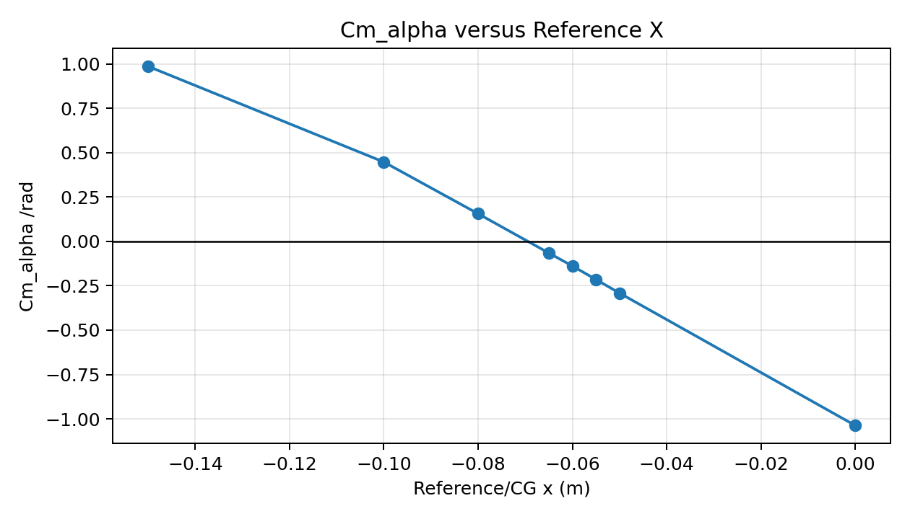
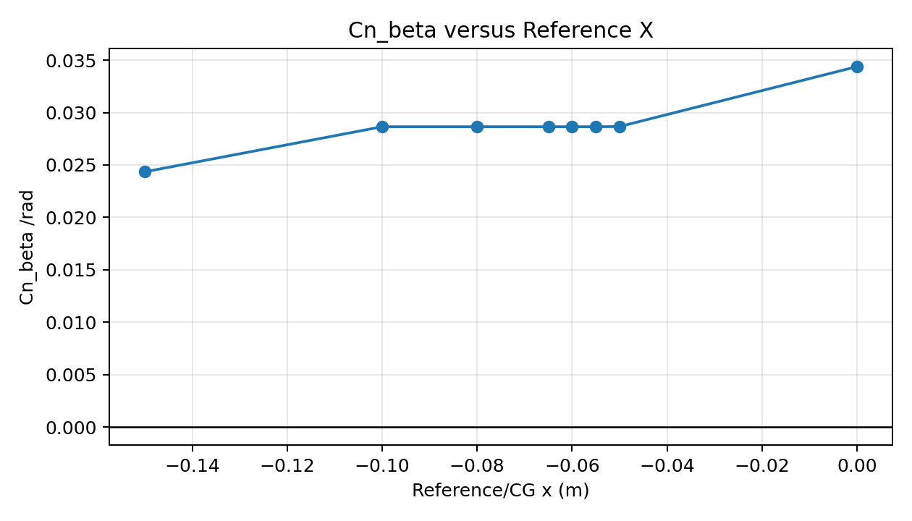
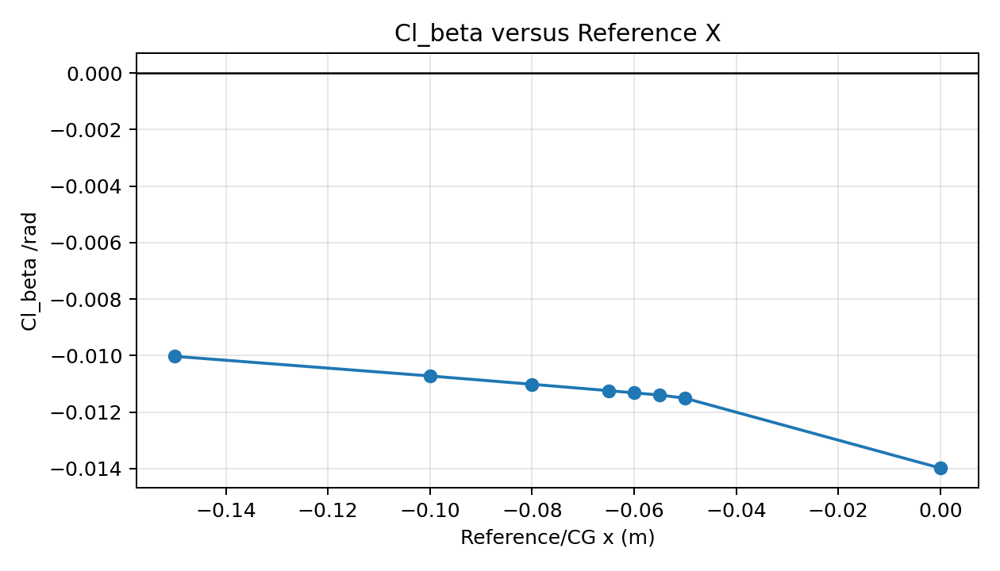
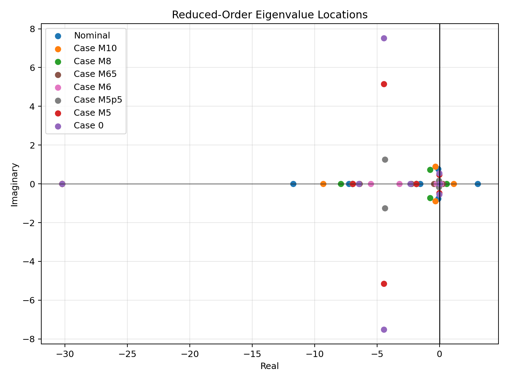
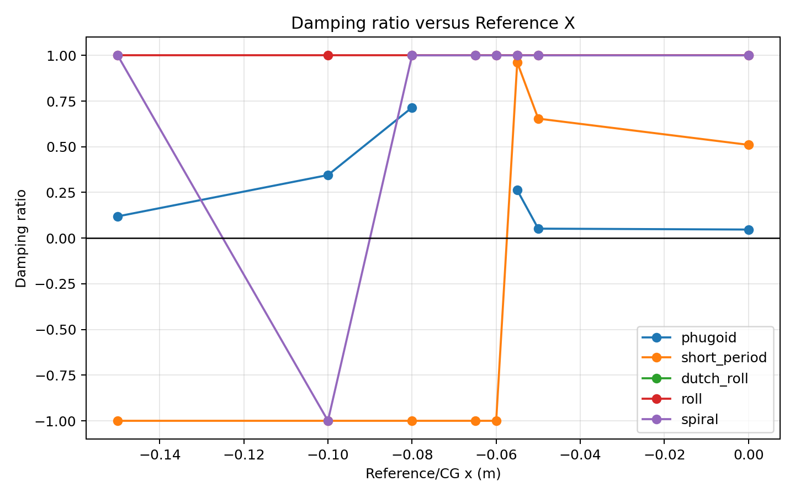
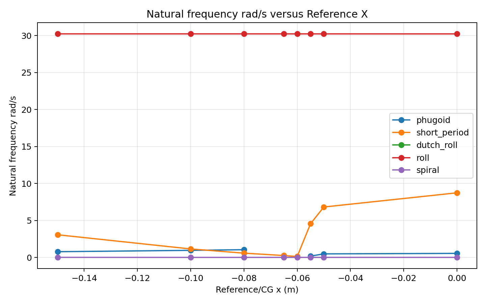
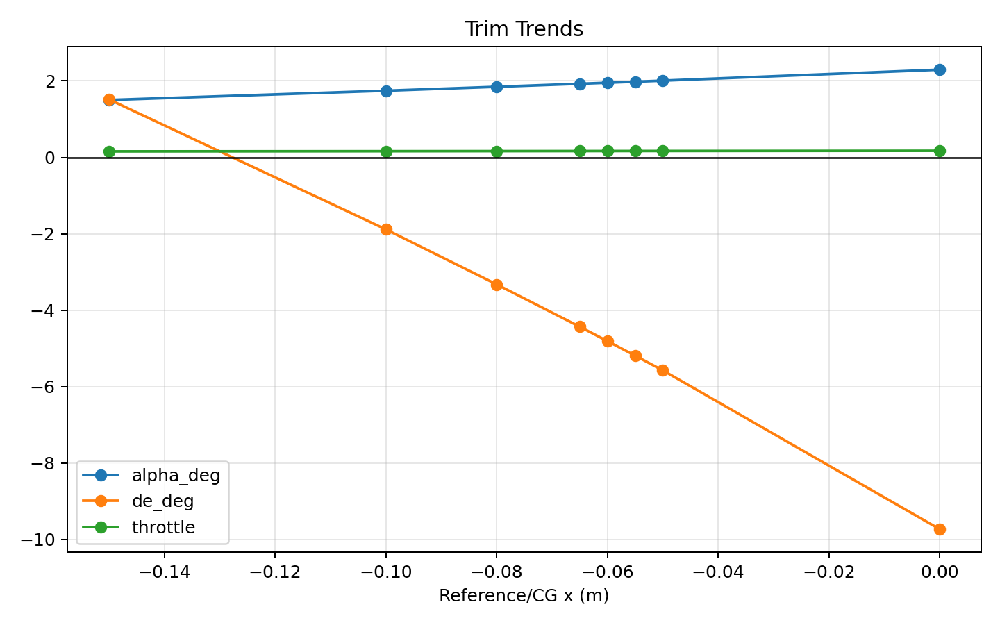

# Preliminary Fixed-Wing Stability Analysis and CG Sensitivity Study

# Status

"Preliminary"

"Revision History: Initial release"

"Replacement Log: None"

"Reference: [Preliminary Design Aerodynamic Database](../../Aerodynamics/0002-Preliminary-Design-Aerodynamic-Database/information-note.md)"

# Project Description

This information note documents the preliminary fixed-wing stability analysis performed with the current flight dynamics model (FDM) and the Nondimit-generated aerodynamic databases. The purpose of the work is to understand how longitudinal, lateral, and directional stability characteristics change as the aerodynamic moment reference point / CG location is moved forward along the body x-axis.

The analysis was motivated by the preliminary aerodynamic database finding that the aircraft is not statically stable in pitch at the nominal database reference location by itself. Multiple Nondimit-generated databases were therefore evaluated to identify the approximate transition from unstable to stable behavior and to select a better baseline for future FDM, controls, and CG-envelope development.

This is a preliminary engineering assessment. It is useful for identifying trends and selecting follow-on analysis points, but it is not a flight-test clearance result.

## Objective

The objectives of this study were:

- Verify that the FDM consumes the latest drag-corrected aerodynamic database metadata consistently.
- Compare trim, static stability, and dynamic stability across multiple moment-reference / CG locations.
- Identify the approximate CG/reference region where longitudinal stability changes from unstable to stable.
- Check whether the observed stability trend is physically consistent with moving the aerodynamic moment reference point.
- Document limitations that must be resolved before the results are used for final envelope definition.

## Background

The aerodynamic database was generated from the ADB v1.1 drag-corrected coefficient table. The delivered database uses body axes with `x` forward, `y` right, and `z` down, and the coefficient table is dimensionalized with the following reference values:

| Reference | Value |
|-----------|------:|
| Air density, rho | `1.09 kg/m^3` |
| Reference velocity | `25 m/s` |
| Dynamic pressure, q | `340.625 Pa` |
| Reference area, S | `1.805 m^2` |
| Reference span, b | `3.95 m` |
| Reference chord, c | `0.457 m` |

The nominal drag-corrected database is referenced to `(-0.15, 0.0, 0.15) m`. Additional Nondimit exports were generated with the same aerodynamic force data and different moment reference locations. These cases allow the FDM workflow to compare how the stability derivatives and linearized modes evolve as the reference / CG location moves forward.

The Nondimit consistency check showed that the generated cases are force-consistent with the nominal drag-corrected export. Moment differences match the expected rigid-body moment transfer within export rounding tolerance. The largest moment error in the check was approximately `5e-05 N m`, and the largest force coefficient difference was approximately `1e-04`.

# Methodology

## Aerodynamic Database / Nondimit Workflow

The case databases were generated from the current drag-corrected ADB export. Nondimit was used to recenter the aerodynamic moment outputs at different body-axis x locations while keeping `y = 0.0 m` and `z = 0.15 m`.

The FDM used the database metadata as the source of truth for density, dynamic pressure, reference geometry, and moment center. The model consumed nondimensional body-axis coefficient columns and reconstructed dimensional forces and moments using the database reference values.

## FDM / Stability Workflow

For each database, the FDM workflow:

1. Loaded the aerodynamic database and verified its reference metadata.
2. Set the aircraft CG / moment reference consistently with the database case.
3. Computed a fixed-wing longitudinal trim condition.
4. Linearized the model around the trim point.
5. Computed static stability derivatives.
6. Classified the identified longitudinal and lateral-directional modes.
7. Compared trends across all analyzed cases.

The dynamic classification includes phugoid, short-period, roll, spiral, and lateral-directional oscillatory behavior where identifiable. Because the aircraft uses an inverse V-tail / ruddervator configuration, the lateral-directional classification is treated cautiously. No clearly identifiable Dutch-roll-like lateral-directional oscillatory mode was found in this linearization.

## Analyzed Cases

Eight generated database cases were included:

| Case | Database | Moment Reference / CG, m |
|------|----------|--------------------------|
| Nominal | `adb_v1_1_drag_correction.csv` | `(-0.150, 0.0, 0.150)` |
| Case M10 | `adb_v1_1_drag_correction_m10.csv` | `(-0.100, 0.0, 0.150)` |
| Case M8 | `adb_v1_1_drag_correction_m8.csv` | `(-0.080, 0.0, 0.150)` |
| Case M65 | `adb_v1_1_drag_correction_m65.csv` | `(-0.065, 0.0, 0.150)` |
| Case M6 | `adb_v1_1_drag_correction_m6.csv` | `(-0.060, 0.0, 0.150)` |
| Case M5p5 | `adb_v1_1_drag_correction_m5p5.csv` | `(-0.055, 0.0, 0.150)` |
| Case M5 | `adb_v1_1_drag_correction_m5.csv` | `(-0.050, 0.0, 0.150)` |
| Case 0 | `adb_v1_1_drag_correction_0.csv` | `(0.000, 0.0, 0.150)` |

Individual case reports are provided in:

- [Nominal](cases/nominal_stability_report.md)
- [Case M10](cases/case_m10_stability_report.md)
- [Case M8](cases/case_m8_stability_report.md)
- [Case M65](cases/case_m65_stability_report.md)
- [Case M6](cases/case_m6_stability_report.md)
- [Case M5p5](cases/case_m5p5_stability_report.md)
- [Case M5](cases/case_m5_stability_report.md)
- [Case 0](cases/case_0_stability_report.md)

# Results and Deliverables

## Case-by-Case Summary

| Case | x_ref, m | Trim Status | Alpha, deg | Elevator, deg | Cm_alpha | Longitudinal Dynamic Result | Spiral Result |
|------|---------:|-------------|-----------:|--------------:|---------:|-----------------------------|---------------|
| Nominal | -0.150 | Converged | 1.5005 | +1.5157 | +0.9855 | Unstable short-period / divergence | Stable |
| M10 | -0.100 | Converged | 1.7432 | -1.8846 | +0.4469 | Unstable short-period / divergence | Weakly unstable |
| M8 | -0.080 | Converged | 1.8458 | -3.3242 | +0.1556 | Unstable short-period / divergence | Stable |
| M65 | -0.065 | Converged | 1.9248 | -4.4307 | -0.0657 | Unstable longitudinal real root | Stable |
| M6 | -0.060 | Converged | 1.9516 | -4.8077 | -0.1388 | Unstable longitudinal real root | Stable |
| M5p5 | -0.055 | Converged | 1.9787 | -5.1878 | -0.2148 | Stable identified longitudinal modes | Stable |
| M5 | -0.050 | Converged | 2.0061 | -5.5737 | -0.2914 | Stable identified longitudinal modes | Stable |
| 0 | 0.000 | Converged | 2.2937 | -9.7286 | -1.0371 | Stable identified longitudinal modes | Stable |

All cases trimmed successfully. Elevator trim becomes increasingly negative as the reference location moves forward. Case 0 has the strongest longitudinal static stability but also requires the largest elevator trim deflection, so it should be treated as a forward stability bound rather than an automatic baseline.

## Static Stability Comparison

| Case | x_ref, m | Cm_alpha, 1/rad | Cn_beta, 1/rad | Cl_beta, 1/rad | Static Summary |
|------|---------:|----------------:|---------------:|---------------:|----------------|
| Nominal | -0.150 | +0.9855 | +0.0243 | -0.0100 | Pitch unstable, directional/lateral signs favorable |
| M10 | -0.100 | +0.4469 | +0.0286 | -0.0107 | Pitch unstable, directional/lateral signs favorable |
| M8 | -0.080 | +0.1556 | +0.0286 | -0.0110 | Pitch unstable but near transition |
| M65 | -0.065 | -0.0657 | +0.0286 | -0.0112 | Pitch statically stable |
| M6 | -0.060 | -0.1388 | +0.0286 | -0.0113 | Pitch statically stable |
| M5p5 | -0.055 | -0.2148 | +0.0286 | -0.0114 | Pitch statically stable |
| M5 | -0.050 | -0.2914 | +0.0287 | -0.0115 | Pitch statically stable |
| 0 | 0.000 | -1.0371 | +0.0344 | -0.0140 | Strongest sampled static pitch stability |

`Cm_alpha` decreases monotonically as the reference / CG location moves forward. Linear interpolation places the static pitch-stability crossing, `Cm_alpha = 0`, near `x = -0.0695 m`.

Directional static stability, represented here by `Cn_beta`, remains positive for all sampled cases. Lateral static stability, represented by negative `Cl_beta`, remains favorable for all sampled cases. These lateral-directional static trends are less sensitive than the longitudinal trend.

## Dynamic Stability Comparison

| Case | Phugoid | Short-Period / Longitudinal Limiting Mode | Roll | Spiral | Dutch-Roll-Like Lateral-Directional Mode |
|------|---------|-------------------------------------------|------|--------|------------------------------------------|
| Nominal | Stable, lightly damped | Unstable | Stable | Stable | Not clearly identifiable |
| M10 | Stable | Unstable | Stable | Weakly unstable | Not clearly identifiable |
| M8 | Stable | Unstable | Stable | Stable | Not clearly identifiable |
| M65 | Not cleanly separated | Unstable real root | Stable | Stable | Not clearly identifiable |
| M6 | Not cleanly separated | Unstable real root | Stable | Stable | Not clearly identifiable |
| M5p5 | Stable | Stable | Stable | Stable | Not clearly identifiable |
| M5 | Stable, lightly damped | Stable | Stable | Stable | Not clearly identifiable |
| 0 | Stable, lightly damped | Stable | Stable | Stable | Not clearly identifiable |

The dynamic longitudinal transition occurs forward of the static `Cm_alpha = 0` crossing. Static pitch stability appears near `x = -0.0695 m`, but the short-period / longitudinal dynamic stability transition occurs closer to `x = -0.0575 m`. The first sampled case with stable identified longitudinal modes is Case M5p5 at `x = -0.055 m`.

No clearly identifiable Dutch-roll-like lateral-directional oscillatory mode was found in this linearization. This does not prove that the aircraft cannot exhibit Dutch-roll-like behavior. The inverse V-tail / ruddervator layout, preliminary inertia assumptions, limited control/rate derivatives, and alpha-beta-only aerodynamic database all make lateral-directional mode classification ambiguous at this stage.

##  CG Sensitivity Trends

Moving the aerodynamic moment reference / CG forward makes the pitching moment slope more stabilizing. This trend is physically consistent with the expected moment-transfer effect from the aerodynamic force resultant: as the reference point moves forward, the same aerodynamic force distribution produces a more stabilizing pitch moment slope.

The key trend points are:

| Trend | Approximate Location |
|-------|---------------------:|
| Static pitch-stability crossing, `Cm_alpha = 0` | `x = -0.0695 m` |
| Dynamic longitudinal stability transition | `x = -0.0575 m` |
| First sampled dynamically stable case | `x = -0.055 m` |
| More practical sampled development baseline | `x = -0.050 m` |

The most sensitive stability behavior is longitudinal. Directional and lateral static derivatives remain favorable across the sampled range and change more gradually.

## Stable / Unstable Region Summary

The nominal, M10, and M8 cases are statically unstable in pitch and dynamically unstable in the identified longitudinal response. M65 and M6 are statically stable in pitch but remain dynamically unstable in the current linearization. M5p5, M5, and Case 0 have stable identified longitudinal modes.

Case 0 has the strongest sampled longitudinal static margin, but the required elevator trim is much larger than the nearby transition cases. For near-term development, Case M5 at `x = -0.05 m` is recommended as the practical baseline because it has more margin than the first stable sampled case while remaining close to the identified transition region. Case M5p5 at `x = -0.055 m` should be retained as the current sampled estimate of the aft stability boundary.

## Limitations

The following limitations apply:

- The analysis uses preliminary mass properties, inertia, propulsion, and control assumptions.
- The current aerodynamic database is primarily alpha-beta based and does not include the final control-surface database.
- Rate damping and control derivatives are not yet mature enough for final dynamic-mode classification.
- No clearly identifiable Dutch-roll-like lateral-directional oscillatory mode was found in this linearization; this should be treated as a model limitation and classification ambiguity, not as proof that Dutch-roll-like behavior is impossible.
- The stability boundary was estimated from discrete Nondimit-generated cases with interpolation between samples.
- Results are based on linearization around modeled trim points and should be validated with time-domain simulations and higher-fidelity aerodynamic/control data.

## Recommendations

Use Case M5, `x = -0.05 m`, as the near-term FDM baseline for continued fixed-wing development. Retain Case M5p5, `x = -0.055 m`, as a boundary case for refining the aft stable region. Additional Nondimit cases near `x = -0.0575 m` would help narrow the dynamic transition.

Future database generation should preserve explicit metadata for density, velocity, dynamic pressure, reference area, span, chord, and moment center. The FDM should continue treating delivered database metadata as the source of truth rather than relying on stale hardcoded defaults.

Before using these results for envelope definition, the FDM should be updated with improved mass properties, control-surface derivatives, rate derivatives, and propulsion effects. The inverse V-tail / ruddervator lateral-directional behavior should be revisited with a more complete model so that Dutch-roll-like coupled oscillatory behavior can be classified more reliably.

## Source Files

The compact results included with this information note are:

- [Stability metrics summary CSV](data/stability_metrics_summary.csv)
- [Stability modes summary CSV](data/stability_modes_summary.csv)
- [Nondimit moment-transfer check CSV](data/nondimit_moment_transfer_check.csv)
- Individual case reports in [cases/](cases/)
- Comparison figures in [figures/](figures/)

## Conclusion

The stability sweep found a clear, physically consistent trend: moving the aerodynamic moment reference / CG forward improves longitudinal stability. Static pitch stability appears near `x = -0.0695 m`, while the dynamic longitudinal transition appears closer to `x = -0.0575 m`. The first sampled case with stable identified longitudinal modes is M5p5 at `x = -0.055 m`; M5 at `x = -0.05 m` provides a more practical near-term development baseline.

The results support continuing fixed-wing stability development using the forward-shifted Nondimit databases while treating the current stability boundary as preliminary. The next phase should validate the transition region with improved mass properties, control data, and lateral-directional modeling appropriate for the inverse V-tail / ruddervator configuration.
