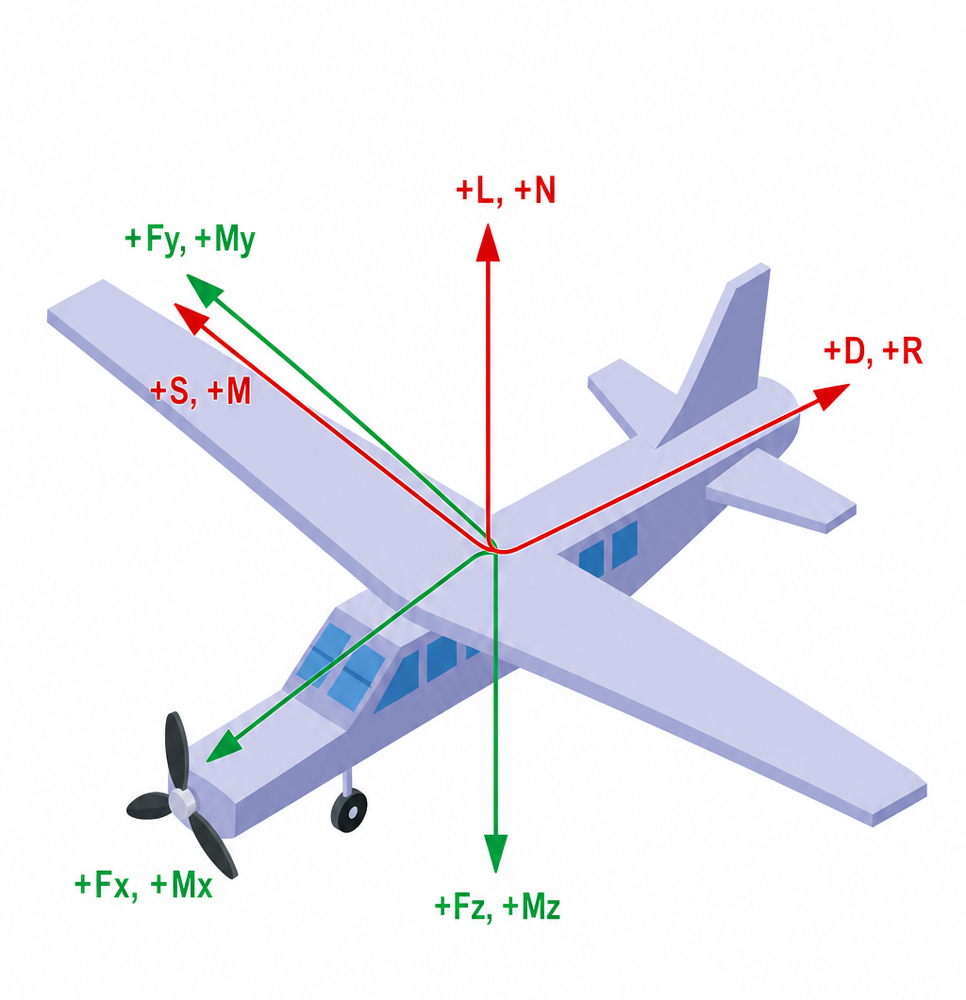

# Nondimit v1.1 One Pager

## Purpose

Nondimit is a standalone desktop tool for turning dense aerodynamic force and moment tables into coefficient database files. It is intended for AeroDB and CFD export workflows where the source file contains dimensional forces and moments over alpha and beta, and the final file needs nondimensional body and wind-frame coefficients.

The tool can also reopen an existing Nondimit export and modify it without rerunning CFD. This can be used to move the moment reference center, change the nondimensionalization reference values, or do both in the same saved file.



The illustration shows the force and moment directions. The table below defines the body and wind-frame notation used by the tool.

| Frame axis | Force name | Moment name | Force coefficient | Moment coefficient | Positive direction |
| --- | --- | --- | --- | --- | --- |
| Body `+x` | `Fx` | `Mx` | `cfx` | `cmx` | Forward toward the nose. |
| Body `+y` | `Fy` | `My` | `cfy` | `cmy` | Toward the aircraft right wing. |
| Body `+z` | `Fz` | `Mz` | `cfz` | `cmz` | Down. |
| Wind `+x` | `D` | `R` | `cd` | `cr` | Aft along the drag direction, opposite the velocity direction. |
| Wind `+y` | `S` | `M` | `cs` | `cm` | Side direction. At zero beta this matches body `+y`. |
| Wind `+z` | `L` | `N` | `cl` | `cn` | Up along the lift direction. |

## Launch

Run:

```bat
Start_Nondimit.bat
```

The launcher starts `Nondimit.exe` when present. If the EXE is missing, it falls back to `nondimit.py`.

## Main Workflows

### Convert Raw Table

Use this tab when starting from a raw dense CSV with dimensional force and moment columns.

1. Select the input CSV.
2. Choose the output path.
3. Enter reference values:
   - density `rho`
   - reference area `S`
   - velocity `V`
   - span for roll and yaw moments
   - chord for pitch moment
   - output rounding accuracy
4. Set optional force and moment corrections.
5. Enter old and new moment centers in body-axis coordinates.
6. Confirm column mapping for alpha, beta, `Fx`, `Fy`, `Fz`, and optionally `Mx`, `My`, `Mz`.
7. Set optional beta-zero cleanup and output group order.
8. Click `Convert and Save`.

If moments are mapped, the tool writes force and moment coefficients. If moment columns are not mapped, it writes force coefficients only.

### Modify Export

Use this tab when you already have a coefficient CSV from Nondimit and need to change the moment center, the nondimensionalization reference values, or the output formatting.

1. Select the existing Nondimit export.
2. The tool reads the metadata rows and fills in `rho`, `S`, `V`, span, chord, output accuracy, and current moment center.
3. Edit the reference values if the output should use a different nondimensionalization.
4. Set optional force and moment corrections.
5. Enter the new body-axis moment center if the moment reference should move. Leave it equal to the current center if only the reference values should change.
6. Confirm alpha and beta columns.
7. Set optional beta-zero cleanup and output group order.
8. Click `Modify and Save`.

The current center is read from `moment_center_body_xyz` in the input file metadata. Older exports that used `new_moment_center_body_xyz` still load correctly. New output metadata reports only the final selected moment center, not the previous center.

The reference values in this tab are intentionally editable. When **rho**, **S**, **V**, span, or chord are changed, the tool recalculates all force and moment coefficients with the edited values:

$$
q = \frac{1}{2}\rho V^2
$$

$$
\text{force denominator} = qS
$$

$$
\text{roll and yaw moment denominator} = qSb
$$

$$
\text{pitch moment denominator} = qSc
$$

Normal Nondimit exports include dimensional body force and moment columns, so the tool preserves the physical forces and moments, applies any requested moment-center shift, and then writes new coefficients from the edited reference values. If an export has been manually stripped down to coefficient-only columns, do not use this tab to change reference values, because the physical forces and moments cannot be recovered unambiguously.

## Optional Output Controls

### Force and Moment Corrections

The Corrections section can apply a multiplier and an additive delta to every force and moment component. The correction frame controls which component names are used:

| Frame | Force components | Moment components |
| --- | --- | --- |
| None | no correction | no correction |
| Body | Fx, Fy, Fz | Mx, My, Mz |
| Wind | D, S, L | R, M, N |

Each corrected component is calculated as:

$$
X_{corrected} = m_X X_{original} + \Delta X
$$

For the known missing-component drag correction, use the Wind frame and set D multiplier to 1.3. Leave S, L, R, M, and N multipliers at 1.0 and all deltas at 0.0 unless there is separate calibration evidence for those components.

When the Wind frame is selected, the tool projects the body-axis vector into the wind frame using alpha and beta, applies the selected multipliers and deltas, and reconstructs the body-axis vector before writing the final body and wind columns. This keeps Fx/Fy/Fz and D/S/L internally consistent. Moment corrections work the same way for Mx/My/Mz and R/M/N.

Force corrections are applied before moment-center shifting, so a moment-center shift uses the corrected force vector. Direct moment corrections are applied after the moment-center shift.

### Beta = 0 Cleanup

The checkboxes `Fy`, `Mx`, and `Mz` force those components to zero only on rows where beta is numerically zero. This is useful for symmetric prop-off databases where small solver noise should not create side force, roll moment, or yaw moment at zero sideslip.

The cleanup is applied before coefficients and wind-frame values are written, so body and wind outputs remain internally consistent. Selected cleanup options are stored in metadata as `zero_at_beta0`.

### Output Group Order

The ordered list controls how the generated output columns are arranged. The four groups are:

- Body Forces: `Fx`, `Fy`, `Fz`
- Body Moments: `Mx`, `My`, `Mz`
- Wind Forces: `D`, `S`, `L`
- Wind Moments: `R`, `M`, `N`

Use `Up`, `Down`, and `Reset` to reorder them. Each group keeps its coefficient columns and dimensional columns together. The selected order is stored in metadata as `output_group_order`.

## Coordinate and Coefficient Conventions

The tool uses standard aircraft body axes and aerodynamic wind-axis notation.

Body frame directions are `x` forward, `y` right, and `z` downward. Wind-frame directions are `D` aft along the drag direction, `S` sideways, and `L` upward. The moment symbols `R`, `M`, and `N` are the wind-frame roll, pitch, and yaw moments about those same wind-frame axes.

The generated body coefficient columns are:

```text
cfx, cfy, cfz
cmx, cmy, cmz
```

The generated wind coefficient columns are:

```text
cd, cs, cl
cr, cm, cn
```

The generated dimensional body and wind columns are:

```text
Fx, Fy, Fz
Mx, My, Mz
D, S, L
R, M, N
```

Nondimensionalization and dimensionalization use the reference values written in the export metadata. The dynamic pressure and denominators are:

$$
q = \frac{1}{2}\rho V^2
$$

$$
\text{force denominator} = qS
$$

$$
\text{roll and yaw moment denominator} = qSb
$$

$$
\text{pitch moment denominator} = qSc
$$

Body-axis force coefficients are:

$$
C_{F_x} = \frac{F_x}{qS}
$$

$$
C_{F_y} = \frac{F_y}{qS}
$$

$$
C_{F_z} = \frac{F_z}{qS}
$$

Wind-frame force coefficients are:

$$
C_D = \frac{D}{qS}
$$

$$
C_S = \frac{S_w}{qS}
$$

$$
C_L = \frac{L}{qS}
$$

Body-axis moment coefficients are:

$$
C_{M_x} = \frac{M_x}{qSb}
$$

$$
C_{M_y} = \frac{M_y}{qSc}
$$

$$
C_{M_z} = \frac{M_z}{qSb}
$$

Wind-frame moment coefficients are:

$$
C_R = \frac{R}{qSb}
$$

$$
C_M = \frac{M}{qSc}
$$

$$
C_N = \frac{N}{qSb}
$$

To recover dimensional values from coefficients, use the inverse form:

$$
F_x = C_{F_x}\,qS, \quad F_y = C_{F_y}\,qS, \quad F_z = C_{F_z}\,qS
$$

$$
D = C_D\,qS, \quad S_w = C_S\,qS, \quad L = C_L\,qS
$$

$$
M_x = C_{M_x}\,qSb, \quad M_y = C_{M_y}\,qSc, \quad M_z = C_{M_z}\,qSb
$$

$$
R = C_R\,qSb, \quad M = C_M\,qSc, \quad N = C_N\,qSb
$$

In the equations above, $S_w$ is the wind-frame side force. The corresponding output column is named **S**.

## Moment Center Operation

Moment shifting is done in body axes before coefficient conversion:

$$
\mathbf{M}_{new} = \mathbf{M}_{old} + \mathbf{r}_{new \rightarrow old} \times \mathbf{F}
$$

where:

$$
\mathbf{r}_{new \rightarrow old} = \mathbf{x}_{old\ center} - \mathbf{x}_{new\ center}
$$

After the body-axis moment is shifted, the tool projects both force and moment vectors into the wind frame using the row's alpha and beta.

## Output File

The saved CSV starts with a short readable metadata block, then the normal CSV header row, then table data. The metadata block is intentionally kept to only a few comment rows: reference values, final body-axis moment center, and source/options. It reports only the final moment reference center used by the exported coefficients. Selected correction frame, force multipliers, force deltas, moment multipliers, and moment deltas are stored in the options row.

Generated columns include body and wind-frame coefficients plus dimensional body and wind-frame force and moment columns. Numeric table cells are rounded to the requested output accuracy.

Recommended sanity checks after export:

- Beta-zero rows have `Fy`, `Mx`, and `Mz` equal to zero if those cleanup options were selected.
- Moment signs change as expected when moving the reference center.
- Force and moment correction metadata matches the intended frame, multipliers, and deltas.
- Metadata values match the intended `rho`, `S`, `V`, span, chord, and final moment center.
